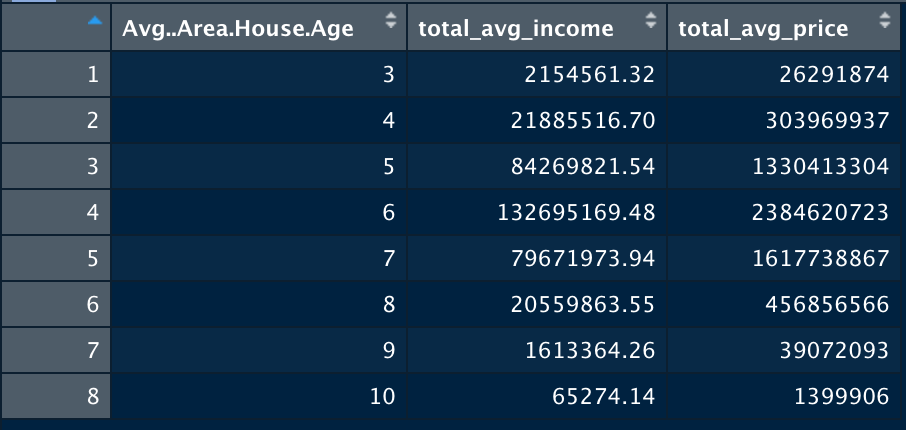
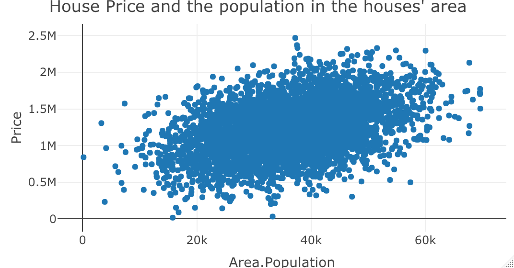
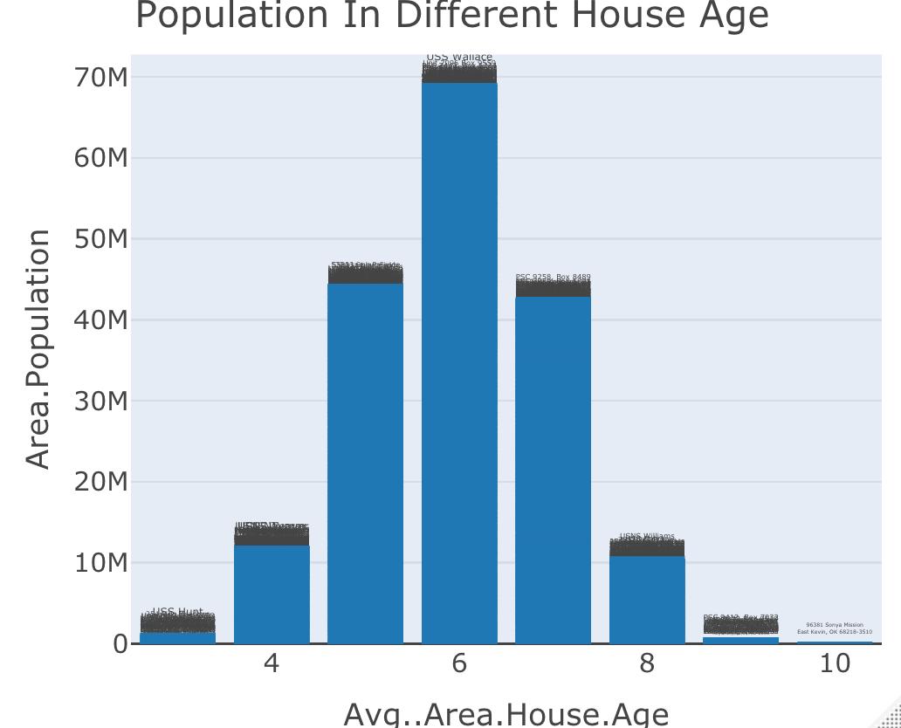

---
output:
  pdf_document: default
  html_document: default
---
# Introduction
Houses could be the most valuable asset for most people, and different areas
with different variables will affect the prices of the housing prices of those
areas. To anaylsis what variables have a direct impact on the housing prices in
an area, a dataset with many values related to various areas' housing markets
are incredible important to accomplish this, and that is what our dataset is
trying to answer by providing tons of data on the US housing market.

# Summary
From our calculating, we collected a list of information related to our USA
housing dataset. We summarized that the maximum house price is 2469066 dollars,
the minimum house price is 15938.66 dollars, total average of house price is
1232073 dollars, the total average of household income is 68583.11 dollars, the
total average of house age is 5.977222 year.

# Aggregate Table

We included this table because we think this can tell us a lot about the house
age ranges that people live in. From the table, we can see that the older the
house age is, the less people live in them, while the newer houses have
significantly more people live in them. However, it would seem that more people
live in houses that are roughly 6 years old more than houses in any other age.

# Charts

The first plot is made with the house price as its y value and the area 
population of the said houses. The purpose of the chart is to show the
relationship between the house prices and the population of the area in 
which the houses are. From the chart, it is clear that there is a 
positive correlation between the house price and the population of the area 
where the houses are. Thus, houses are tend to be more expensive if 
the population of the area is higher, possibly for the landowners to earn 
more profits.

The purpose of this chart is that we want to explore whether older houses
have more people living in, and what age houses are most preferred by 
people. Before I draw the chart, I have rounded all the house age to an
integer so that it will help me to draw and explained the graph better.
As the graph show, we can easily see the population is increasing from 0 
years house to 6 years house and then the population is decreasing from 6
years house to 10 years house. Overall, the sixth years house is the most
popular house age. We think that People don't like houses that are too new
or too old.