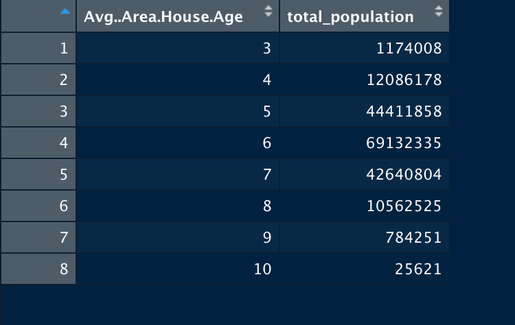

---
output:
  pdf_document: default
  html_document: default
---
# Introduction
Houses could be the most valuable asset for most people, and different areas with different variables will affect the prices of the housing prices of those areas. To anaylsis what variables have a direct impact on the housing prices in an area, a dataset with many values related to various areas' housing markets are incredible important to accomplish this, and that is what our dataset is trying to answer by providing tons of data on the US housing market.

# Summary
From our calculating, we collected a list of information related to our USA housing dataset. We summarized that the maximum house price is 2469066 dollars, the minimum house price is 15938.66 dollars, total average of house price is 1232073 dollars, the total average of household income is 68583.11 dollars, the total average of house age is 5.977222 year.

# Aggregate Table

We included this table because we think this can tell us a lot about the current US housing market. For one, the older the house age is, the cheaper the price and the lower the average income is of that area. However, it also seems like that if the house is newer than 4 years of age, the housing price and the area income also gets lower, though not as low as the houses with 10 years of age. It seems that houses that are 6 years old tends to have the most expensive prices and subsequently higher area income. Which also indicates that housing prices and the area income have a positive correlation.